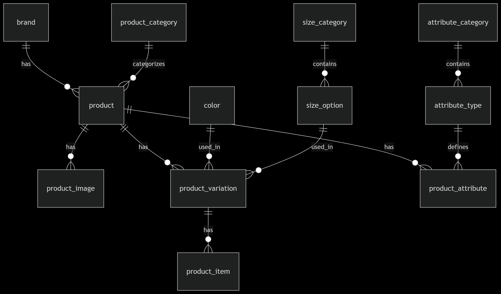

# E-commerce Database Design

This project is part of the Power Learn Project assignment. It includes an Entity-Relationship Diagram (ERD) and SQL file to design and implement a database for an e-commerce platform.

**Cohort:** 2025 February  
**Group:** 720

---

## 📌 Project Overview

This database is designed to support an e-commerce platform with features including:
- Product listings
- Product variations (size, color)
- Stock management
- Brand and category classification
- Custom product attributes

---

## 🧩 ERD (Entity-Relationship Diagram)

  
> The ERD illustrates all tables, relationships, primary keys, and foreign keys used in the database.

---

## 🗃️ Database Tables

Key tables in the schema:
- `brand`
- `product_category`
- `product`
- `product_image`
- `color`
- `size_category`
- `size_option`
- `product_variation`
- `product_item`
- `attribute_category`
- `attribute_type`
- `product_attribute`

---

## ⚙️ Files

| File | Description |
|------|-------------|
| `ecommerce.sql` | SQL script to create all tables and constraints |
| `ecommerce-erd.png` | Visual diagram of the database schema |

---

## 🚀 Getting Started

To use the database:
1. Open your MySQL client (e.g., MySQL Workbench)
2. Run the `ecommerce.sql` file
3. The tables will be created in your database

---

## 🤝 Group Collaboration

This project was built collaboratively by the following members of the Power Learn Project group:

- **Ifeanyi Amobi** – ifeanyipaschal803@gmail.com  
- **Cynthia Kimathi** – cynthiakimathi@gmail.com  
- **Pontsho Mathobela** – pontshomathobs@gmail.com  
- **George Midamba** – gtimon404@gmail.com  
- **Greenwood Maeria** – ntabathiagreenwood@gmail.com  
- **Chinaza Udoegbulam** – chinazaamandaudoegbulam@gmail.com  
- **Al-mujahid Al-imam** – almujahidalimam@gmail.com  
- **Mercy Ndungu** – ndungumercyalice@gmail.com  
- **Lordphick Obwanda** – obwandalordphick14@gmail.com  
- **Alfonce Kipkemoi Ngetich** – alfoncekngetich@gmail.com  

---

## License

This project is for educational purposes only.
